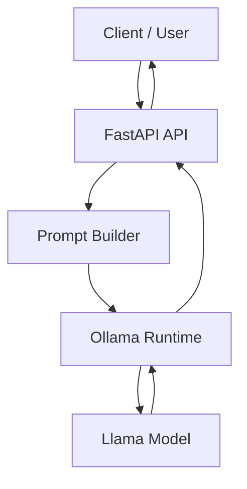

# CareerCopilot API

CareerCopilot is an AI-powered career guidance API that helps users improve resumes and analyze job descriptions using a locally hosted large language model.

The project demonstrates how to integrate a modern API framework with a local LLM to build a lightweight AI service that provides structured career advice and job insights.

This project was built as an **AI product prototype** to showcase practical skills in API design, prompt engineering, and LLM integration.

-----------------------------

# Problem

Many job seekers struggle to understand how their resumes align with job descriptions and which skills to highlight when applying for roles.

Career advice is often spread across blogs, career websites, and resume guides, making it difficult for users to quickly extract useful insights.

-----------------------------

# Solution

CareerCopilot provides a simple AI API that helps users:

- Ask questions about resume writing and career development
- Analyze job descriptions to identify key responsibilities and skills
- Extract important keywords that should be emphasized in resumes

The system exposes structured API endpoints that can easily be integrated into web applications, career tools, or learning platforms.

-----------------------------

# Features

- AI-powered resume guidance
- Job description analysis
- Structured AI API endpoints
- FastAPI backend
- Local LLM inference using Ollama
- Interactive API documentation

-----------------------------

# Architecture



The API acts as a lightweight AI service layer. User requests are processed through FastAPI, transformed into structured prompts, and sent to a locally hosted LLM through Ollama. The generated response is returned to the client via the API.

-----------------------------

# API Endpoints

## POST /chat

Provides AI-powered career advice and resume guidance.

### Example request

```json
{
  "question": "How should I structure a product manager resume?"
}
```

### Example response

```json
{
  "status": "success",
  "model": "llama3.2:1b",
  "answer": "A product manager resume should highlight..."
}
```

---

## POST /job-analysis

Analyzes a job description and extracts important insights.

### Example request

```json
{
  "job_description": "We are looking for a product manager to define product strategy and work cross-functionally with engineering and design teams."
}
```

### Example output

- core responsibilities  
- required skills  
- preferred skills  
- resume keywords to emphasize  

-----------------------------

# Tech Stack

- Python  
- FastAPI  
- Ollama  
- Llama Model  
- Requests  
- Pydantic  

-----------------------------

# Project Structure

```
careercopilot/
│
├── main.py
├── requirements.txt
├── README.md
│
├── data/
│   └── resume_knowledge.txt
│
└── tests/
```

-----------------------------

# Running the Project

## 1. Install dependencies

```
pip install -r requirements.txt
```

## 2. Start the API

```
uvicorn main:app --reload
```

## 3. Open API documentation

```
http://127.0.0.1:8000/docs
```

-----------------------------

# Example Use Cases

- Resume improvement tools
- Career coaching platforms
- Job preparation assistants
- AI-powered learning applications

-----------------------------

# Future Improvements

- Resume feedback endpoint
- Retrieval-Augmented Generation (RAG) for grounded responses
- API authentication
- Cloud deployment
- Frontend interface for career coaching
